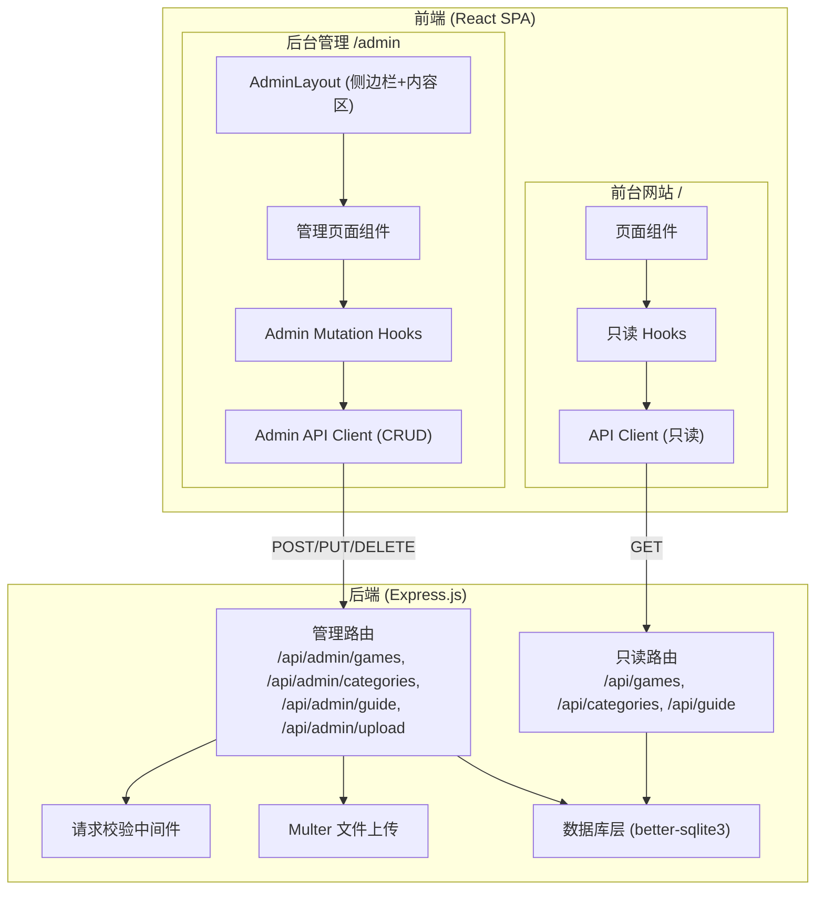
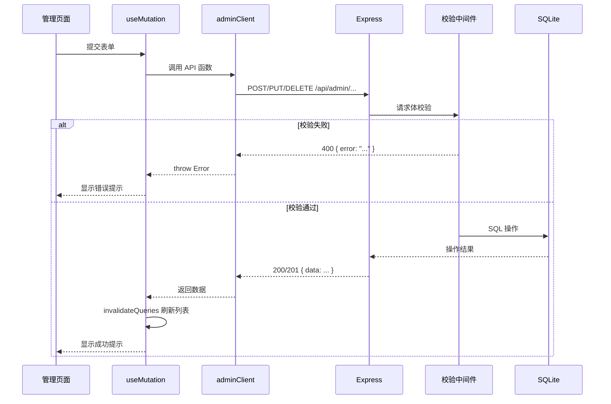

# 技术设计文档：后台管理系统（Admin Dashboard）

## 概述

本设计文档描述为桌游攻略网站添加后台管理系统的技术方案。管理系统将复用现有 React + shadcn/ui 技术栈，在同一个 SPA 中通过 `/admin` 路由前缀提供独立的管理界面。后端在现有 Express.js 服务上新增 `/api/admin` 前缀的管理 API，支持对所有数据表的 CRUD 操作和图片上传。

### 技术选型

| 组件 | 技术 | 理由 |
|------|------|------|
| 管理前端 | React + shadcn/ui + React Router | 复用现有技术栈，无需引入新框架 |
| 表单处理 | react-hook-form + zod | 项目已安装，提供类型安全的表单校验 |
| 数据请求 | @tanstack/react-query（mutation） | 复用现有 React Query 基础设施，mutation 处理写操作 |
| 图片上传 | multer | Express 生态最成熟的文件上传中间件 |
| 拖拽排序 | @dnd-kit/core + @dnd-kit/sortable | 轻量级 React 拖拽库，适合列表排序场景 |
| 后端管理 API | Express.js Router | 复用现有后端架构，新增 admin 路由模块 |
| 数据库 | SQLite（better-sqlite3） | 复用现有数据库，无需新增表 |

### 项目目录结构变更

```
project-root/
├── server/
│   ├── src/
│   │   ├── routes/
│   │   │   ├── games.ts              # 现有只读路由
│   │   │   ├── categories.ts         # 现有只读路由
│   │   │   ├── guide.ts              # 现有只读路由
│   │   │   └── admin/                # 新增：管理 API 路由
│   │   │       ├── games.ts          # 游戏 CRUD
│   │   │       ├── categories.ts     # 分类选项与快速链接管理
│   │   │       ├── guide.ts          # FAQ 与指南步骤管理
│   │   │       └── upload.ts         # 图片上传
│   │   ├── middleware/
│   │   │   ├── errorHandler.ts       # 现有错误处理
│   │   │   └── validation.ts         # 新增：请求校验中间件
│   │   └── ...
│   └── public/images/                # 图片存储目录（含上传图片）
├── src/
│   ├── api/
│   │   ├── client.ts                 # 现有只读 API 客户端
│   │   └── adminClient.ts            # 新增：管理 API 客户端
│   ├── pages/
│   │   ├── admin/                    # 新增：后台管理页面
│   │   │   ├── AdminLayout.tsx       # 管理后台布局（侧边栏 + 内容区）
│   │   │   ├── Dashboard.tsx         # 仪表盘概览
│   │   │   ├── GamesManage.tsx       # 游戏管理
│   │   │   ├── GameDetailManage.tsx  # 游戏详情管理
│   │   │   ├── CategoryOptions.tsx   # 分类选项管理
│   │   │   ├── QuickLinks.tsx        # 快速链接管理
│   │   │   ├── FAQsManage.tsx        # 常见问题管理
│   │   │   └── GuideSteps.tsx        # 新手指南步骤管理
│   │   └── ...
│   └── hooks/
│       ├── useGameData.ts            # 现有只读 hooks
│       └── useAdminData.ts           # 新增：管理 mutation hooks
└── ...
```

## 架构

### 整体架构图



### 管理 API 请求流程



## 组件与接口

### 后端管理 API 接口定义

#### 游戏管理接口

| 方法 | 路径 | 描述 | 请求体 | 响应 |
|------|------|------|--------|------|
| POST | `/api/admin/games` | 创建游戏 | Game 字段（不含 id） | `201 { data: Game }` |
| PUT | `/api/admin/games/:id` | 更新游戏 | Game 字段（不含 id） | `200 { data: Game }` |
| DELETE | `/api/admin/games/:id` | 删除游戏（级联删除详情） | - | `200 { data: { message } }` |

#### 游戏详情管理接口

| 方法 | 路径 | 描述 | 请求体 | 响应 |
|------|------|------|--------|------|
| POST | `/api/admin/games/:id/details` | 创建游戏详情 | GameDetail 字段 | `201 { data: GameDetail }` |
| PUT | `/api/admin/games/:id/details` | 更新游戏详情 | GameDetail 字段 | `200 { data: GameDetail }` |
| DELETE | `/api/admin/games/:id/details` | 删除游戏详情 | - | `200 { data: { message } }` |

#### 分类选项与快速链接管理接口

| 方法 | 路径 | 描述 | 请求体 | 响应 |
|------|------|------|--------|------|
| PUT | `/api/admin/categories/options` | 更新分类选项 | `{ key, value }` | `200 { data: CategoryOption }` |
| POST | `/api/admin/categories/quick-links` | 创建快速链接 | QuickLink 字段 | `201 { data: QuickLink }` |
| PUT | `/api/admin/categories/quick-links/:id` | 更新快速链接 | QuickLink 字段 | `200 { data: QuickLink }` |
| DELETE | `/api/admin/categories/quick-links/:id` | 删除快速链接 | - | `200 { data: { message } }` |

#### FAQ 与指南步骤管理接口

| 方法 | 路径 | 描述 | 请求体 | 响应 |
|------|------|------|--------|------|
| POST | `/api/admin/guide/faqs` | 创建 FAQ | `{ question, answer }` | `201 { data: FAQ }` |
| PUT | `/api/admin/guide/faqs/:id` | 更新 FAQ | `{ question, answer }` | `200 { data: FAQ }` |
| DELETE | `/api/admin/guide/faqs/:id` | 删除 FAQ | - | `200 { data: { message } }` |
| PUT | `/api/admin/guide/faqs/reorder` | FAQ 排序 | `{ ids: number[] }` | `200 { data: { message } }` |
| POST | `/api/admin/guide/steps` | 创建指南步骤 | `{ step, description }` | `201 { data: GuideStep }` |
| PUT | `/api/admin/guide/steps/:id` | 更新指南步骤 | `{ step, description }` | `200 { data: GuideStep }` |
| DELETE | `/api/admin/guide/steps/:id` | 删除指南步骤 | - | `200 { data: { message } }` |
| PUT | `/api/admin/guide/steps/reorder` | 指南步骤排序 | `{ ids: number[] }` | `200 { data: { message } }` |

#### 图片上传接口

| 方法 | 路径 | 描述 | 请求体 | 响应 |
|------|------|------|--------|------|
| POST | `/api/admin/upload` | 上传图片 | `multipart/form-data`（file 字段） | `201 { data: { path: "/images/xxx.png" } }` |

### 请求体校验规则

```typescript
// 游戏创建/更新校验
const gameSchema = z.object({
  title: z.string().min(1, '标题不能为空'),
  type: z.string().min(1, '类型不能为空'),
  players: z.string().min(1, '玩家人数不能为空'),
  time: z.string().min(1, '游戏时长不能为空'),
  image: z.string().min(1, '图片路径不能为空'),
  difficulty: z.string().min(1, '难度不能为空'),
  tags: z.array(z.string()).min(1, '标签不能为空'),
  isHot: z.boolean().optional().default(false),
  rank: z.number().nullable().optional(),
  comment: z.string().nullable().optional(),
  isTrending: z.boolean().optional().default(false),
});

// 游戏详情创建/更新校验
const gameDetailSchema = z.object({
  introduction: z.string().min(1, '简介不能为空'),
  objective: z.string().min(1, '目标不能为空'),
  victoryConditions: z.array(z.object({
    text: z.string().optional(),
    image: z.string().nullable().optional(),
  })).min(1, '获胜条件不能为空'),
  gameplaySteps: z.array(z.object({
    title: z.string(),
    desc: z.union([z.string(), z.array(z.string())]),
    image: z.string().nullable().optional(),
  })).min(1, '玩法步骤不能为空'),
  tips: z.array(z.string()).min(1, '新手提示不能为空'),
});

// 快速链接校验
const quickLinkSchema = z.object({
  name: z.string().min(1, '名称不能为空'),
  icon: z.string().min(1, '图标不能为空'),
  color: z.string().min(1, '颜色不能为空'),
  link: z.string().min(1, '链接不能为空'),
});

// FAQ 校验
const faqSchema = z.object({
  question: z.string().min(1, '问题不能为空'),
  answer: z.string().min(1, '答案不能为空'),
});

// 指南步骤校验
const guideStepSchema = z.object({
  step: z.string().min(1, '步骤名不能为空'),
  description: z.string().min(1, '描述不能为空'),
});
```

### 前端管理 API 客户端接口

```typescript
// src/api/adminClient.ts

// 游戏管理
export async function createGame(data: GameInput): Promise<Game>;
export async function updateGame(id: number, data: GameInput): Promise<Game>;
export async function deleteGame(id: number): Promise<void>;

// 游戏详情管理
export async function createGameDetail(gameId: number, data: GameDetailInput): Promise<GameDetail>;
export async function updateGameDetail(gameId: number, data: GameDetailInput): Promise<GameDetail>;
export async function deleteGameDetail(gameId: number): Promise<void>;

// 分类选项管理
export async function updateCategoryOption(data: { key: string; value: string[] }): Promise<void>;

// 快速链接管理
export async function createQuickLink(data: QuickLinkInput): Promise<QuickLink>;
export async function updateQuickLink(id: number, data: QuickLinkInput): Promise<QuickLink>;
export async function deleteQuickLink(id: number): Promise<void>;

// FAQ 管理
export async function createFAQ(data: FAQInput): Promise<FAQ>;
export async function updateFAQ(id: number, data: FAQInput): Promise<FAQ>;
export async function deleteFAQ(id: number): Promise<void>;
export async function reorderFAQs(ids: number[]): Promise<void>;

// 指南步骤管理
export async function createGuideStep(data: GuideStepInput): Promise<GuideStep>;
export async function updateGuideStep(id: number, data: GuideStepInput): Promise<GuideStep>;
export async function deleteGuideStep(id: number): Promise<void>;
export async function reorderGuideSteps(ids: number[]): Promise<void>;

// 图片上传
export async function uploadImage(file: File): Promise<string>; // 返回图片路径

// 统计数据
export async function fetchDashboardStats(): Promise<DashboardStats>;
```

### 前端管理页面组件

#### AdminLayout 布局组件

使用 shadcn/ui 的 Sidebar 组件构建管理后台布局，包含：
- 左侧固定侧边栏：导航菜单（仪表盘、游戏管理、分类选项、快速链接、FAQ、指南步骤）
- 右侧内容区：通过 React Router `<Outlet />` 渲染子路由页面
- 顶部面包屑导航

#### 路由配置

```typescript
// App.tsx 中新增管理路由
<Route path="/admin" element={<AdminLayout />}>
  <Route index element={<Dashboard />} />
  <Route path="games" element={<GamesManage />} />
  <Route path="games/:id/details" element={<GameDetailManage />} />
  <Route path="category-options" element={<CategoryOptions />} />
  <Route path="quick-links" element={<QuickLinks />} />
  <Route path="faqs" element={<FAQsManage />} />
  <Route path="guide-steps" element={<GuideSteps />} />
</Route>
```

### 图片上传处理方案

```typescript
// server/src/routes/admin/upload.ts
// 使用 multer 处理文件上传

import multer from 'multer';
import { v4 as uuidv4 } from 'uuid';
import path from 'path';

const storage = multer.diskStorage({
  destination: path.join(__dirname, '../../../public/images'),
  filename: (_req, file, cb) => {
    // 使用 UUID 重命名，避免文件名冲突
    const ext = path.extname(file.originalname);
    cb(null, `${uuidv4()}${ext}`);
  },
});

const upload = multer({
  storage,
  limits: { fileSize: 5 * 1024 * 1024 }, // 5MB 上限
  fileFilter: (_req, file, cb) => {
    const allowed = ['image/jpeg', 'image/png', 'image/webp'];
    if (allowed.includes(file.mimetype)) {
      cb(null, true);
    } else {
      cb(new Error('仅支持 JPEG、PNG、WebP 格式'));
    }
  },
});
```

## 数据模型

### 现有数据库表（无需新增表）

本功能复用现有 6 张数据表，不需要新增表结构。所有管理操作直接对现有表进行 CRUD：

| 表名 | 用途 | 管理操作 |
|------|------|----------|
| `games` | 游戏基础信息 | 增删改 |
| `game_details` | 游戏详情 | 增删改 |
| `category_options` | 分类筛选选项 | 改 |
| `quick_links` | 分类快速链接 | 增删改 |
| `faqs` | 常见问题 | 增删改 + 排序 |
| `guide_steps` | 新手指南步骤 | 增删改 + 排序 |

### 管理 API 请求/响应类型定义

```typescript
// 游戏创建/更新输入类型（不含 id）
interface GameInput {
  title: string;
  type: string;
  players: string;
  time: string;
  image: string;
  difficulty: string;
  tags: string[];
  isHot?: boolean;
  rank?: number | null;
  comment?: string | null;
  isTrending?: boolean;
}

// 游戏详情输入类型
interface GameDetailInput {
  introduction: string;
  objective: string;
  victoryConditions: VictoryCondition[];
  gameplaySteps: GameplayStep[];
  tips: string[];
}

// 快速链接输入类型
interface QuickLinkInput {
  name: string;
  icon: string;
  color: string;
  link: string;
}

// FAQ 输入类型
interface FAQInput {
  question: string;
  answer: string;
}

// 指南步骤输入类型
interface GuideStepInput {
  step: string;
  description: string;
}

// 仪表盘统计数据
interface DashboardStats {
  gameCount: number;
  detailCount: number;
  faqCount: number;
  guideStepCount: number;
  quickLinkCount: number;
  categoryOptionCount: number;
}
```

### 数据库操作模式

写入操作统一使用 prepared statements 防止 SQL 注入，JSON 数组字段在写入前通过 `JSON.stringify()` 序列化，读取时通过 `JSON.parse()` 反序列化。布尔字段 `isHot`/`isTrending` 在写入时转换为 0/1 整数。

删除游戏时级联删除关联的 `game_details` 记录：

```sql
-- 删除游戏时先删详情再删游戏
DELETE FROM game_details WHERE game_id = ?;
DELETE FROM games WHERE id = ?;
```

排序操作使用事务批量更新 `sort_order` 字段：

```typescript
// 批量更新排序
const reorder = db.transaction((ids: number[]) => {
  const stmt = db.prepare('UPDATE faqs SET sort_order = ? WHERE id = ?');
  ids.forEach((id, index) => stmt.run(index, id));
});
```


## 正确性属性（Correctness Properties）

*属性是一种在系统所有有效执行中都应成立的特征或行为——本质上是对系统应做什么的形式化陈述。属性是人类可读规格说明与机器可验证正确性保证之间的桥梁。*

### Property 1: 游戏 CRUD round-trip

*对于任意*合法的游戏输入数据（包含所有必填字段），通过 `POST /api/admin/games` 创建后，再通过 `GET /api/games/:id` 查询，返回的数据应与创建时的输入语义等价。同理，通过 `PUT /api/admin/games/:id` 更新后再查询，返回的数据应与更新输入一致。特别是 JSON 数组字段 `tags` 在序列化/反序列化后应保持一致。

**Validates: Requirements 1.1, 1.2**

### Property 2: 游戏详情 CRUD round-trip

*对于任意*已存在的游戏和合法的详情输入数据，通过 `POST /api/admin/games/:id/details` 创建后，再通过 `GET /api/games/:id/details` 查询，返回的数据应与创建时的输入语义等价。通过 `PUT` 更新后再查询同理。JSON 数组字段 `victoryConditions`、`gameplaySteps`、`tips` 在 round-trip 后应保持一致。

**Validates: Requirements 2.1, 2.2**

### Property 3: 分类与快速链接 CRUD round-trip

*对于任意*合法的分类选项更新数据，通过 `PUT /api/admin/categories/options` 更新后，再通过 `GET /api/categories/options` 查询，返回的数据应包含更新后的值。*对于任意*合法的快速链接输入数据，创建或更新后再查询列表，应包含该记录且字段值一致。

**Validates: Requirements 3.1, 3.2, 3.3**

### Property 4: FAQ 与指南步骤 CRUD round-trip

*对于任意*合法的 FAQ 输入数据（question、answer），创建后查询列表应包含该记录。*对于任意*合法的指南步骤输入数据（step、description），创建后查询列表应包含该记录。更新操作同理，更新后查询应返回更新后的值。

**Validates: Requirements 4.1, 4.2, 4.4, 4.5**

### Property 5: 删除后资源不存在

*对于任意*已存在的资源（游戏、游戏详情、快速链接、FAQ、指南步骤），通过对应的 DELETE 接口删除后，再次查询该资源应返回 404 或不出现在列表中。特别地，删除游戏时，其关联的 game_details 记录也应被级联删除。

**Validates: Requirements 1.3, 2.3, 3.4, 4.3, 4.6**

### Property 6: 必填字段校验返回 400

*对于任意*实体类型（Game、GameDetail、QuickLink、FAQ、GuideStep）和*任意*缺少至少一个必填字段的请求体，对应的 POST 或 PUT 接口应返回 HTTP 400 状态码，且响应体包含 `error` 字段说明缺失的字段信息。

**Validates: Requirements 1.4, 2.6, 3.5, 4.7, 4.8**

### Property 7: 排序 round-trip

*对于任意* FAQ 或指南步骤的 id 列表的任意排列，通过 `PUT /api/admin/guide/faqs/reorder` 或 `PUT /api/admin/guide/steps/reorder` 提交新排序后，再通过对应的 GET 接口查询，返回的列表顺序应与提交的排列顺序一致。

**Validates: Requirements 4.9, 4.10**

### Property 8: 图片上传路径格式与文件名唯一性

*对于任意*合法的图片文件（JPEG/PNG/WebP，≤5MB），通过 `POST /api/admin/upload` 上传后，返回的路径应以 `/images/` 开头，文件名部分应为 UUID 格式（不等于原始文件名），且该文件应实际存在于 `server/public/images/` 目录中。

**Validates: Requirements 5.1, 5.6**

### Property 9: 非法文件格式拒绝

*对于任意*非 JPEG/PNG/WebP 格式的文件（如 GIF、BMP、TXT 等），通过 `POST /api/admin/upload` 上传时，应返回 HTTP 400 状态码和格式错误描述信息。

**Validates: Requirements 5.2, 5.4**

### Property 10: 非法 JSON 请求体返回 400

*对于任意*写入端点（POST、PUT），当请求体为空或非合法 JSON 时，应返回 HTTP 400 状态码。

**Validates: Requirements 6.1**

### Property 11: 响应格式不变量

*对于任意*成功的管理 API 写入操作（返回 2xx），响应体应为合法 JSON 且包含 `data` 字段。*对于任意*失败的管理 API 请求（返回 4xx/5xx），响应体应为合法 JSON 且包含 `error` 字段（字符串类型）。

**Validates: Requirements 6.2, 6.3**

### Property 12: 非数字 id 参数返回 400

*对于任意*包含 `:id` 路径参数的管理 API 端点，当 id 为非数字字符串时，应返回 HTTP 400 状态码。

**Validates: Requirements 6.5**

### Property 13: 仪表盘统计与数据库一致

*对于任意*数据库状态，仪表盘统计接口返回的各表记录数应与数据库中对应表的实际 `COUNT(*)` 值一致。

**Validates: Requirements 10.4**

### Property 14: 动态列表增删不变量

*对于任意*游戏详情表单中的动态列表（获胜条件、玩法步骤、新手提示），添加一项后列表长度应加 1，删除一项后列表长度应减 1，且列表中其他项的内容和顺序不变。

**Validates: Requirements 8.4, 8.5, 8.6**

## 错误处理

### 后端错误处理策略

1. **请求体校验失败**：使用 zod schema 校验请求体，校验失败返回 HTTP 400，`{ error: "具体字段错误描述" }`
2. **路径参数校验**：`:id` 参数非数字时返回 HTTP 400，`{ error: "无效的 ID" }`
3. **资源不存在**：操作的目标资源不存在时返回 HTTP 404，`{ error: "资源不存在" }`
4. **唯一约束冲突**：如重复创建游戏详情时返回 HTTP 409，`{ error: "该游戏已存在详情记录" }`
5. **文件上传错误**：格式不支持返回 HTTP 400，文件过大返回 HTTP 400，multer 错误统一捕获处理
6. **数据库异常**：未预期的数据库错误返回 HTTP 500，`{ error: "服务器内部错误" }`，不暴露堆栈信息
7. **复用现有错误处理中间件**：`notFoundHandler` 和 `errorHandler` 继续作为全局兜底

### 前端错误处理策略

1. **API 请求错误**：adminClient 中统一处理非 2xx 响应，解析 `error` 字段抛出 Error
2. **表单校验错误**：react-hook-form + zod 在提交前进行客户端校验，显示字段级错误提示
3. **服务端校验错误**：API 返回 400 时，在表单顶部或对应字段显示服务端错误信息
4. **mutation 错误**：React Query useMutation 的 onError 回调中使用 sonner toast 显示错误提示
5. **加载状态**：mutation 的 isPending 状态用于禁用提交按钮和显示加载指示器，防止重复提交
6. **乐观更新**：删除和排序操作可考虑乐观更新，失败时回滚并显示错误提示

## 测试策略

### 双重测试方法

本项目采用单元测试 + 属性测试的双重策略，确保全面覆盖。

### 属性测试（Property-Based Testing）

- **库选择**：使用 `fast-check` 作为属性测试库
- **测试框架**：Vitest
- **最低迭代次数**：每个属性测试至少运行 100 次
- **标签格式**：每个测试用注释标注对应的设计属性，格式为 `Feature: admin-dashboard, Property {number}: {property_text}`
- **每个正确性属性对应一个属性测试**

属性测试重点覆盖：
- CRUD round-trip（Property 1-4）：生成随机合法数据，创建/更新后查询验证一致性
- 删除后不存在（Property 5）：创建随机资源后删除，验证查询返回 404
- 必填字段校验（Property 6）：生成随机缺失字段的请求体，验证返回 400
- 排序 round-trip（Property 7）：生成随机排列，验证排序后查询顺序一致
- 图片上传（Property 8）：生成随机合法图片，验证路径格式和文件存在
- 非法格式拒绝（Property 9）：生成随机非法格式文件，验证返回 400
- 非法 JSON（Property 10）：生成随机非法请求体，验证返回 400
- 响应格式不变量（Property 11）：对所有端点验证响应格式
- 非数字 id（Property 12）：生成随机非数字字符串，验证返回 400
- 仪表盘统计（Property 13）：随机增删数据后验证统计一致性
- 动态列表增删（Property 14）：随机增删列表项验证长度不变量

### 单元测试

单元测试聚焦于具体示例和边界情况：

- **边界情况**：删除不存在的游戏返回 404（Requirements 1.5, 1.6）
- **冲突处理**：重复创建游戏详情返回 409（Requirements 2.5）
- **外键约束**：为不存在的游戏创建详情返回 404（Requirements 2.4）
- **文件大小限制**：上传超过 5MB 的文件返回 400（Requirements 5.3, 5.5）
- **数据库异常**：模拟数据库错误，验证返回 500 且不暴露细节（Requirements 6.4）
- **UI 渲染测试**：游戏管理表格包含所有必要列（Requirements 7.1）
- **UI 交互测试**：新增/编辑弹窗、删除确认、加载状态（Requirements 7.2-7.7）
- **条件渲染**：有/无详情时的不同展示（Requirements 8.2, 8.3）
- **路由测试**：/admin 路径渲染管理界面（Requirements 10.1）
- **侧边栏测试**：包含所有菜单项且点击切换高亮（Requirements 10.2, 10.3）
