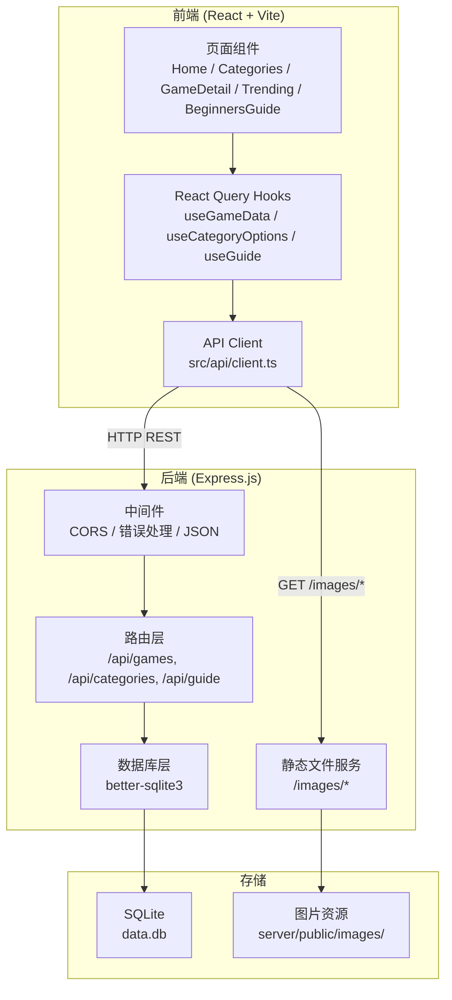
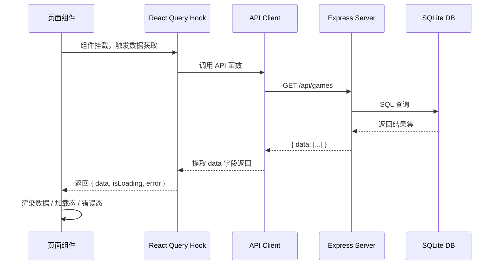

# 技术设计文档：后端数据服务

## 概述

本设计文档描述将桌游攻略网站从纯前端静态数据架构改造为前后端分离架构的技术方案。核心目标是将 `src/constant/` 下的硬编码游戏数据迁移到 SQLite 数据库，通过 Express.js 提供 RESTful API，前端通过 API 客户端获取数据。

### 技术选型

| 组件 | 技术 | 理由 |
|------|------|------|
| 运行时 | Node.js + TypeScript | 与前端共享类型定义，统一技术栈 |
| Web 框架 | Express.js | 成熟稳定，生态丰富，适合轻量级只读 API |
| 数据库 | SQLite（better-sqlite3） | 零配置，文件级存储，适合小数据量只读场景 |
| 项目结构 | Monorepo（server/ 目录） | 前后端共享仓库，便于管理和部署 |

### 项目目录结构

```
project-root/
├── server/                    # 后端服务目录
│   ├── package.json
│   ├── tsconfig.json
│   ├── src/
│   │   ├── index.ts           # 入口文件，启动服务
│   │   ├── db.ts              # 数据库连接与初始化
│   │   ├── seed.ts            # 种子数据脚本
│   │   ├── routes/
│   │   │   ├── games.ts       # 游戏相关路由
│   │   │   ├── categories.ts  # 分类选项路由
│   │   │   └── guide.ts       # 新手指南路由
│   │   ├── middleware/
│   │   │   └── errorHandler.ts # 统一错误处理中间件
│   │   └── types.ts           # 共享类型定义
│   ├── public/                # 静态资源目录（图片）
│   │   └── images/            # 从 src/assets/ 复制的游戏图片
│   └── data.db                # SQLite 数据库文件
├── src/                       # 前端源码（现有）
│   ├── api/
│   │   └── client.ts          # API 客户端模块（新增）
│   ├── hooks/
│   │   └── useGameData.ts     # 数据获取 hooks（新增）
│   └── ...
└── ...
```

## 架构

### 整体架构图



### 请求流程



## 组件与接口

### 后端 API 接口定义

#### 游戏相关接口

| 方法 | 路径 | 描述 | 响应示例 |
|------|------|------|----------|
| GET | `/api/games` | 获取所有游戏列表 | `{ data: Game[] }` |
| GET | `/api/games/trending` | 获取热门游戏 | `{ data: Game[] }` |
| GET | `/api/games/ranked` | 获取排行榜游戏（按 rank 升序） | `{ data: Game[] }` |
| GET | `/api/games/:id` | 获取指定游戏 | `{ data: Game }` |
| GET | `/api/games/:id/details` | 获取游戏详情 | `{ data: GameDetail }` |

> 注意：`/api/games/trending` 和 `/api/games/ranked` 路由必须在 `/api/games/:id` 之前注册，避免 `trending`/`ranked` 被当作 `:id` 参数解析。

#### 分类选项接口

| 方法 | 路径 | 描述 | 响应示例 |
|------|------|------|----------|
| GET | `/api/categories/options` | 获取筛选选项 | `{ data: { types, playerCounts, durations } }` |
| GET | `/api/categories/quick-links` | 获取分类快速链接 | `{ data: QuickLink[] }` |

#### 新手指南接口

| 方法 | 路径 | 描述 | 响应示例 |
|------|------|------|----------|
| GET | `/api/guide/faqs` | 获取常见问题 | `{ data: FAQ[] }` |
| GET | `/api/guide/steps` | 获取基础流程步骤 | `{ data: GuideStep[] }` |

### 统一响应格式

```typescript
// 成功响应
interface SuccessResponse<T> {
  data: T;
}

// 错误响应
interface ErrorResponse {
  error: string;
}
```

### 前端 API 客户端接口

```typescript
// src/api/client.ts

// 基础 URL，支持环境变量覆盖
const BASE_URL = import.meta.env.VITE_API_BASE_URL || 'http://localhost:3001';

// 游戏相关
export async function fetchAllGames(): Promise<Game[]>;
export async function fetchTrendingGames(): Promise<Game[]>;
export async function fetchRankedGames(): Promise<Game[]>;
export async function fetchGameById(id: number): Promise<Game>;
export async function fetchGameDetails(id: number): Promise<GameDetail>;

// 分类相关
export async function fetchCategoryOptions(): Promise<CategoryOptions>;
export async function fetchQuickLinks(): Promise<QuickLink[]>;

// 新手指南
export async function fetchFAQs(): Promise<FAQ[]>;
export async function fetchGuideSteps(): Promise<GuideStep[]>;
```

### React Query Hooks

项目已安装 `@tanstack/react-query`，利用它管理服务端状态：

```typescript
// src/hooks/useGameData.ts
export function useTrendingGames();   // Home 页面
export function useQuickLinks();      // Home 页面
export function useAllGames();        // Categories 页面
export function useCategoryOptions(); // Categories 页面
export function useGameById(id: number);      // GameDetail 页面
export function useGameDetails(id: number);   // GameDetail 页面
export function useRankedGames();     // Trending 页面
export function useFAQs();            // BeginnersGuide 页面
export function useGuideSteps();      // BeginnersGuide 页面
```

## 数据模型

### SQLite 数据库 Schema

#### games 表

```sql
CREATE TABLE games (
  id INTEGER PRIMARY KEY,
  title TEXT NOT NULL,
  type TEXT NOT NULL,
  players TEXT NOT NULL,
  time TEXT NOT NULL,
  image TEXT NOT NULL,
  difficulty TEXT NOT NULL,
  tags TEXT NOT NULL,          -- JSON 数组，如 '["聚会必备","推理"]'
  is_hot INTEGER NOT NULL DEFAULT 0,  -- 0=false, 1=true
  rank INTEGER,                -- 可选，排行榜排名
  comment TEXT,                -- 可选，推荐语
  is_trending INTEGER NOT NULL DEFAULT 0  -- 0=false, 1=true
);
```

#### game_details 表

```sql
CREATE TABLE game_details (
  id INTEGER PRIMARY KEY AUTOINCREMENT,
  game_id INTEGER NOT NULL UNIQUE,
  introduction TEXT NOT NULL,
  objective TEXT NOT NULL,
  victory_conditions TEXT NOT NULL,  -- JSON 数组，如 '[{"text":"...","image":"..."}]'
  gameplay_steps TEXT NOT NULL,      -- JSON 数组，如 '[{"title":"...","desc":"...","image":"..."}]'
  tips TEXT NOT NULL,                -- JSON 数组，如 '["提示1","提示2"]'
  FOREIGN KEY (game_id) REFERENCES games(id)
);
```

#### category_options 表

```sql
CREATE TABLE category_options (
  id INTEGER PRIMARY KEY AUTOINCREMENT,
  key TEXT NOT NULL UNIQUE,    -- 'types' | 'playerCounts' | 'durations'
  value TEXT NOT NULL           -- JSON 数组
);
```

#### quick_links 表

```sql
CREATE TABLE quick_links (
  id INTEGER PRIMARY KEY AUTOINCREMENT,
  name TEXT NOT NULL,
  icon TEXT NOT NULL,
  color TEXT NOT NULL,
  link TEXT NOT NULL
);
```

#### faqs 表

```sql
CREATE TABLE faqs (
  id INTEGER PRIMARY KEY AUTOINCREMENT,
  question TEXT NOT NULL,
  answer TEXT NOT NULL,
  sort_order INTEGER NOT NULL DEFAULT 0
);
```

#### guide_steps 表

```sql
CREATE TABLE guide_steps (
  id INTEGER PRIMARY KEY AUTOINCREMENT,
  step TEXT NOT NULL,
  description TEXT NOT NULL,
  sort_order INTEGER NOT NULL DEFAULT 0
);
```

### TypeScript 类型定义

```typescript
// server/src/types.ts

export interface Game {
  id: number;
  title: string;
  type: string;
  players: string;
  time: string;
  image: string;
  difficulty: string;
  tags: string[];
  isHot: boolean;
  rank?: number;
  comment?: string;
  isTrending: boolean;
}

export interface VictoryCondition {
  text?: string;
  image?: string | null;
}

export interface GameplayStep {
  title: string;
  desc: string | string[];
  image?: string | null;
}

export interface GameDetail {
  gameId: number;
  introduction: string;
  objective: string;
  victoryConditions: VictoryCondition[];
  gameplaySteps: GameplayStep[];
  tips: string[];
}

export interface CategoryOptions {
  types: string[];
  playerCounts: string[];
  durations: string[];
}

export interface QuickLink {
  name: string;
  icon: string;
  color: string;
  link: string;
}

export interface FAQ {
  q: string;
  a: string;
}

export interface GuideStep {
  step: string;
  desc: string;
}
```

### 数据库行到 TypeScript 对象的映射

SQLite 中 `tags`、`victory_conditions`、`gameplay_steps`、`tips` 等字段以 JSON 字符串存储，查询时通过 `JSON.parse()` 转换。`is_hot` 和 `is_trending` 为 INTEGER（0/1），映射为 boolean。

```typescript
// 示例：数据库行 -> Game 对象
function rowToGame(row: any): Game {
  return {
    id: row.id,
    title: row.title,
    type: row.type,
    players: row.players,
    time: row.time,
    image: row.image,
    difficulty: row.difficulty,
    tags: JSON.parse(row.tags),
    isHot: row.is_hot === 1,
    rank: row.rank ?? undefined,
    comment: row.comment ?? undefined,
    isTrending: row.is_trending === 1,
  };
}
```

### 图片资源处理

1. 将 `src/assets/` 下的游戏图片复制到 `server/public/images/` 目录
2. 数据库中存储相对路径，如 `/images/catan.png`
3. Express 配置静态文件服务：`app.use('/images', express.static('public/images'))`
4. 前端通过 `${BASE_URL}/images/catan.png` 访问图片

图片路径映射表：

| 原路径 | 数据库存储路径 |
|--------|---------------|
| `src/assets/langren.png` | `/images/langren.png` |
| `src/assets/catan.png` | `/images/catan.png` |
| `src/assets/uno_icon.png` | `/images/uno_icon.png` |
| `src/assets/awalon.png` | `/images/awalon.png` |
| `src/assets/sanguosha.png` | `/images/sanguosha.png` |
| `src/assets/manila.png` | `/images/manila.png` |
| `src/assets/deguoxinzangbing.png` | `/images/deguoxinzangbing.png` |
| `src/assets/zypy.png` | `/images/zypy.png` |
| `src/assets/catan/catan_1.png` | `/images/catan/catan_1.png` |
| `src/assets/catan/catan_2.png` | `/images/catan/catan_2.png` |
| `src/assets/catan/catan_3.png` | `/images/catan/catan_3.png` |


## 正确性属性（Correctness Properties）

*属性是一种在系统所有有效执行中都应成立的特征或行为——本质上是对系统应做什么的形式化陈述。属性是人类可读规格说明与机器可验证正确性保证之间的桥梁。*

### Property 1: 数据存储 round-trip

*对于任意*有效的数据实体（Game、GameDetail、CategoryOption、FAQ、GuideStep、QuickLink），将其写入 SQLite 数据库后再查询出来，应得到与原始对象语义等价的结果。特别是 JSON 数组字段（tags、victoryConditions、gameplaySteps、tips）在序列化/反序列化后应保持一致。

**Validates: Requirements 1.1, 1.2, 1.3, 1.4**

### Property 2: GET /api/games 返回完整列表

*对于任意*数据库中的 Game 记录集合，`GET /api/games` 接口返回的列表长度应等于数据库中 games 表的总记录数，且返回列表中的每条记录都能在数据库中找到对应的原始数据。

**Validates: Requirements 3.1**

### Property 3: 按 ID 查询返回正确数据

*对于任意*数据库中存在的 Game ID，`GET /api/games/:id` 返回的数据应与数据库中该 ID 对应的记录一致；同理，*对于任意*存在 GameDetail 的 Game ID，`GET /api/games/:id/details` 返回的数据应与数据库中对应记录一致。

**Validates: Requirements 3.2, 3.4**

### Property 4: trending 过滤正确性

*对于任意*数据库中的 Game 记录集合，`GET /api/games/trending` 返回的每条记录的 `isTrending` 字段都应为 `true`，且返回列表的长度应等于数据库中 `is_trending = 1` 的记录总数。

**Validates: Requirements 3.6**

### Property 5: ranked 过滤与排序正确性

*对于任意*数据库中的 Game 记录集合，`GET /api/games/ranked` 返回的每条记录都应具有非空的 `rank` 字段，返回列表的长度应等于数据库中 `rank IS NOT NULL` 的记录总数，且列表应按 `rank` 值严格升序排列。

**Validates: Requirements 3.7**

### Property 6: 成功响应格式不变量

*对于任意*成功的 API 请求（返回 HTTP 200），响应体应为合法 JSON，包含 `data` 字段，且响应头 `Content-Type` 应包含 `application/json`。

**Validates: Requirements 5.1, 5.4**

### Property 7: 错误响应格式不变量

*对于任意*失败的 API 请求（返回 HTTP 4xx 或 5xx），响应体应为合法 JSON，包含 `error` 字段（字符串类型），且响应头 `Content-Type` 应包含 `application/json`。

**Validates: Requirements 5.2**

### Property 8: API 客户端响应处理

*对于任意*后端返回的成功响应（包含 `{ data: T }` 结构），API 客户端函数应返回 `T`（即提取 `data` 字段）；*对于任意*后端返回的错误响应（非 2xx 状态码），API 客户端函数应抛出包含错误描述的异常。

**Validates: Requirements 6.3, 6.4**

### Property 9: 图片路径格式不变量

*对于任意*数据库中存储的图片路径字符串，它应以 `/images/` 开头，不应包含 Vite 模块导入语法（如 `import`、`@/assets`），且应为合法的 URL 路径格式。

**Validates: Requirements 8.2**

## 错误处理

### 后端错误处理策略

1. **数据库连接失败**：服务启动时检测数据库连接，失败则输出错误日志并 `process.exit(1)`
2. **路由级 404**：当请求的资源 ID 不存在时，返回 `{ error: "游戏不存在" }` 或 `{ error: "游戏详情不存在" }`，HTTP 404
3. **参数校验**：`:id` 参数非数字时返回 HTTP 400，`{ error: "无效的游戏 ID" }`
4. **全局异常捕获**：Express 错误处理中间件捕获所有未处理异常，返回 HTTP 500，`{ error: "服务器内部错误" }`，不暴露堆栈信息
5. **未匹配路由**：返回 HTTP 404，`{ error: "接口不存在" }`

### 前端错误处理策略

1. **网络错误**：API 客户端捕获 `fetch` 异常，抛出包含错误描述的 Error
2. **非 2xx 响应**：API 客户端解析响应体中的 `error` 字段，抛出包含该描述的 Error
3. **React Query 错误状态**：各 Hook 返回 `error` 状态，页面组件根据 `isError` 显示错误提示
4. **加载状态**：各 Hook 返回 `isLoading` 状态，页面组件显示骨架屏或加载指示器

## 测试策略

### 双重测试方法

本项目采用单元测试 + 属性测试的双重策略，确保全面覆盖。

### 属性测试（Property-Based Testing）

- **库选择**：使用 `fast-check` 作为属性测试库（TypeScript 生态中最成熟的 PBT 库）
- **测试框架**：Vitest
- **最低迭代次数**：每个属性测试至少运行 100 次
- **标签格式**：每个测试用注释标注对应的设计属性，格式为 `Feature: backend-data-service, Property {number}: {property_text}`
- **每个正确性属性对应一个属性测试**

属性测试重点覆盖：
- 数据库 round-trip（Property 1）
- API 端点返回数据的完整性和正确性（Property 2-5）
- 响应格式不变量（Property 6-7）
- API 客户端行为（Property 8）
- 图片路径格式（Property 9）

### 单元测试

单元测试聚焦于具体示例和边界情况，避免与属性测试重复覆盖：

- **种子脚本验证**：执行种子脚本后验证 8 条 Game 记录和 3 条 GameDetail 记录（Requirements 1.5, 1.6）
- **404 错误处理**：请求不存在的 Game ID 返回 404（Requirements 3.3, 3.5）
- **500 错误处理**：模拟数据库异常，验证返回 500 且不暴露内部细节（Requirements 5.3）
- **CORS 配置**：验证响应包含正确的 CORS 头部（Requirements 2.3）
- **端口配置**：验证默认端口 3001 和自定义端口（Requirements 2.2）
- **环境变量覆盖**：验证 API 客户端 BASE_URL 可通过环境变量配置（Requirements 6.2）
- **页面集成测试**：验证各页面组件正确调用 API 并渲染数据/加载态/错误态（Requirements 7.1-7.7）
- **静态文件服务**：验证图片资源可通过 HTTP 访问（Requirements 8.1, 8.4）
