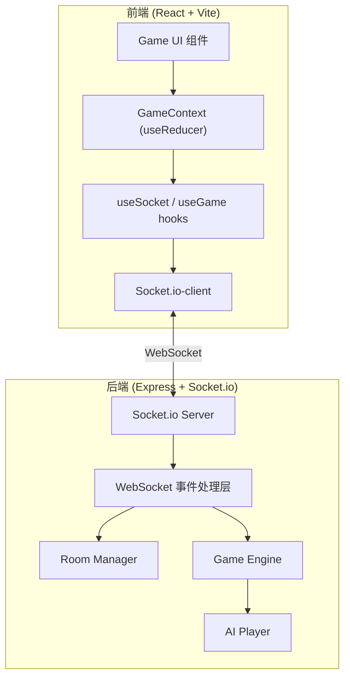
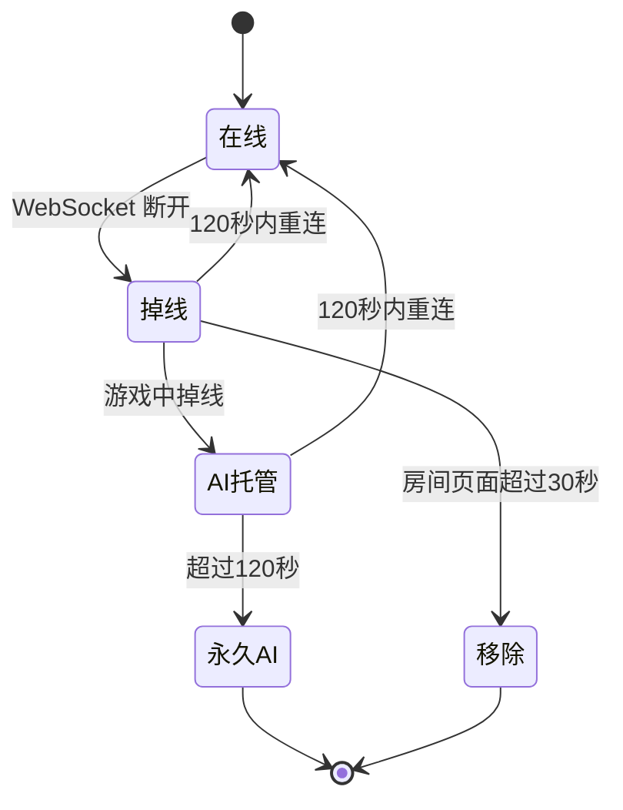

# 技术设计文档 — UNO 联机游戏

## 概述

本设计文档描述在现有桌游攻略网站基础上新增 UNO 联机游戏模块的技术方案。系统采用 Socket.io 实现前后端实时通信，后端在现有 Express 服务上集成 Socket.io 共享端口 3001，前端通过 React + Tailwind + Socket.io-client 构建游戏 UI。

核心技术选型：
- 实时通信：Socket.io（服务端 `socket.io`，客户端 `socket.io-client`）
- 后端状态管理：内存中维护房间和游戏状态（Map 结构），不持久化到 SQLite
- 前端状态管理：React Context + useReducer 管理游戏状态，自定义 hooks 封装 Socket.io 交互
- 前端路由：`/uno` 前缀下的独立路由组

设计决策说明：
1. 游戏状态存内存而非数据库：UNO 游戏是短时会话，无需持久化，内存操作性能更优
2. Socket.io 集成到现有 Express：复用端口 3001，避免额外端口管理，Socket.io 原生支持此模式
3. Context + useReducer 而非 Redux：游戏状态局限于 `/uno` 路由内，无需全局状态库

## 架构

### 整体架构图



### 后端模块划分

```
server/src/uno/
├── types.ts          # UNO 游戏类型定义
├── engine.ts         # Game Engine：核心游戏逻辑（纯函数为主）
├── room.ts           # Room Manager：房间生命周期管理
├── ai.ts             # AI Player：托管出牌策略
├── socket.ts         # WebSocket 事件处理层：注册事件、参数校验、调度
└── timer.ts          # 计时器管理：回合超时、颜色选择超时、质疑超时
```

### 前端模块划分

```
src/pages/uno/
├── index.tsx         # UNO 首页（创建/加入房间）
├── Room.tsx          # 房间页面（玩家列表、准备、开始）
├── Game.tsx          # 游戏页面（主游戏界面）
├── Result.tsx        # 结算页面

src/pages/uno/components/
├── CardView.tsx      # 单张牌渲染组件
├── HandCards.tsx     # 手牌区域
├── DiscardPile.tsx   # 弃牌堆
├── DrawPile.tsx      # 摸牌堆
├── PlayerInfo.tsx    # 其他玩家信息
├── ColorPicker.tsx   # 颜色选择弹窗
├── ChallengeDialog.tsx  # 质疑决策弹窗
├── UnoButton.tsx     # UNO 喊牌按钮
├── GameMessages.tsx  # 消息提示区域
└── DirectionIndicator.tsx # 出牌方向指示

src/pages/uno/hooks/
├── useSocket.ts      # Socket.io 连接管理
└── useGame.ts        # 游戏状态管理（Context + useReducer）

src/pages/uno/context/
└── GameContext.tsx    # 游戏状态 Context 定义
```

## 组件与接口

### 后端：Game Engine（engine.ts）

Game Engine 是游戏核心逻辑模块，设计为纯函数为主，便于测试。

```typescript
// 牌组初始化：生成标准 108 张 UNO 牌
function createDeck(): Card[]

// Fisher-Yates 洗牌
function shuffleDeck(deck: Card[]): Card[]

// 判断出牌合法性
function isValidPlay(card: Card, topCard: Card, currentColor: CardColor): boolean

// 获取玩家手牌中所有可出的牌
function getPlayableCards(hand: Card[], topCard: Card, currentColor: CardColor): Card[]

// 执行出牌：返回更新后的游戏状态
function playCard(state: GameState, playerId: string, cardId: string, chosenColor?: CardColor): GameState

// 执行摸牌：从摸牌堆取牌，必要时重洗弃牌堆
function drawCard(state: GameState, playerId: string): { state: GameState; drawnCard: Card }

// 处理功能牌效果
function applyActionEffect(state: GameState, card: Card): GameState

// 推进到下一回合
function advanceTurn(state: GameState): GameState

// 质疑 Wild+4：检查出牌方是否持有同色牌
function checkChallenge(state: GameState, challengerId: string): ChallengeResult

// 初始化游戏：发牌、翻起始牌、处理起始牌效果
function initGame(playerIds: string[]): GameState

// 判断游戏是否结束
function checkWinner(state: GameState): string | null

// 重洗弃牌堆到摸牌堆
function reshuffleDiscardToDraw(state: GameState): GameState
```

### 后端：Room Manager（room.ts）

```typescript
// 创建房间：生成 6 位房间号，创建者为房主
function createRoom(playerName: string, socketId: string): Room

// 加入房间：校验房间状态后加入
function joinRoom(roomId: string, playerName: string, socketId: string): Room

// 离开房间
function leaveRoom(roomId: string, playerId: string): Room | null

// 玩家准备/取消准备
function toggleReady(roomId: string, playerId: string): Room

// 检查是否可以开始游戏
function canStartGame(room: Room): boolean

// 获取房间信息
function getRoom(roomId: string): Room | undefined

// 处理玩家断线
function handleDisconnect(socketId: string): { roomId: string; playerId: string } | null

// 处理玩家重连
function handleReconnect(roomId: string, playerId: string, newSocketId: string): Room | null
```

### 后端：AI Player（ai.ts）

```typescript
// AI 出牌决策：按优先级选择出牌
function aiDecide(hand: Card[], topCard: Card, currentColor: CardColor): AiDecision

// AI 选择颜色：选手牌中数量最多的颜色
function aiChooseColor(hand: Card[]): CardColor

// AI 是否质疑：始终不质疑
function aiShouldChallenge(): boolean
```

### 后端：WebSocket 事件处理层（socket.ts）

```typescript
// 初始化 Socket.io 并注册所有事件处理
function initSocketServer(httpServer: HttpServer): SocketIOServer
```

### 前端：useSocket hook

```typescript
function useSocket(): {
  socket: Socket | null;
  connected: boolean;
  emit: (event: string, data: unknown) => void;
}
```

### 前端：useGame hook

```typescript
function useGame(): {
  gameState: GameState;
  room: Room | null;
  playCard: (cardId: string, chosenColor?: CardColor) => void;
  drawCard: () => void;
  callUno: () => void;
  reportUno: (targetPlayerId: string) => void;
  challengeWild4: () => void;
  acceptWild4: () => void;
  chooseColor: (color: CardColor) => void;
}
```

## 数据模型

### 核心类型定义（server/src/uno/types.ts）

```typescript
/** 牌的颜色 */
type CardColor = 'red' | 'yellow' | 'blue' | 'green' | 'wild';

/** 牌的类型 */
type CardType = 'number' | 'action' | 'wild';

/** 牌的值 */
type CardValue =
  | 0 | 1 | 2 | 3 | 4 | 5 | 6 | 7 | 8 | 9
  | 'skip' | 'reverse' | 'draw_two'
  | 'wild' | 'wild_draw_four';

/** 单张 UNO 牌 */
interface Card {
  id: string;           // 唯一标识，如 "red-3-1"
  color: CardColor;
  type: CardType;
  value: CardValue;
}

/** 玩家状态 */
interface Player {
  id: string;           // 唯一玩家标识（UUID）
  name: string;         // 昵称（2～8 字符）
  socketId: string;     // 当前 socket 连接 ID
  hand: Card[];         // 手牌
  isReady: boolean;     // 准备状态
  isHost: boolean;      // 是否房主
  isAI: boolean;        // 是否 AI 托管
  isConnected: boolean; // 是否在线
  calledUno: boolean;   // 是否已喊 UNO
}

/** 出牌方向 */
type Direction = 'clockwise' | 'counterclockwise';

/** 游戏阶段 */
type GamePhase =
  | 'playing'           // 正常出牌
  | 'choosing_color'    // 等待选择颜色
  | 'challenging'       // 等待质疑决策
  | 'finished';         // 游戏结束

/** 游戏状态 */
interface GameState {
  roomId: string;
  players: Player[];
  drawPile: Card[];           // 摸牌堆
  discardPile: Card[];        // 弃牌堆
  currentPlayerIndex: number; // 当前操作玩家索引
  direction: Direction;       // 出牌方向
  currentColor: CardColor;    // 当前有效颜色（Wild 牌指定后更新）
  phase: GamePhase;           // 游戏阶段
  lastPlayedCard: Card | null;// 最后打出的牌
  lastPlayerId: string | null;// 最后出牌的玩家
  pendingDrawCount: number;   // 待摸牌数（+2/+4 累积）
  winnerId: string | null;    // 胜利者 ID
  turnStartTime: number;      // 当前回合开始时间戳
  previousColor: CardColor;   // Wild+4 质疑时需要的前一张堆顶颜色
}

/** 房间状态 */
type RoomStatus = 'waiting' | 'playing' | 'finished';

/** 房间 */
interface Room {
  id: string;             // 6 位数字房间号
  players: Player[];
  status: RoomStatus;
  hostId: string;         // 房主玩家 ID
  gameState: GameState | null;
  createdAt: number;
}

/** 质疑结果 */
interface ChallengeResult {
  success: boolean;       // 质疑是否成功
  challengerId: string;
  challengedId: string;
  penaltyCards: number;   // 罚牌数量
}

/** AI 决策结果 */
interface AiDecision {
  action: 'play' | 'draw';
  card?: Card;            // 要出的牌
  chosenColor?: CardColor;// Wild 牌指定的颜色
}

/** 客户端可见的游戏状态（隐藏其他玩家手牌） */
interface ClientGameState {
  roomId: string;
  players: ClientPlayer[];
  topCard: Card;
  drawPileCount: number;
  currentPlayerIndex: number;
  direction: Direction;
  currentColor: CardColor;
  phase: GamePhase;
  myHand: Card[];
  playableCardIds: string[];
  winnerId: string | null;
  turnStartTime: number;
  lastPlayedCard: Card | null;
  lastPlayerId: string | null;
}

/** 客户端可见的玩家信息 */
interface ClientPlayer {
  id: string;
  name: string;
  handCount: number;
  isHost: boolean;
  isAI: boolean;
  isConnected: boolean;
  calledUno: boolean;
}
```


### WebSocket 事件清单

#### 客户端 → 服务端事件

| 事件名 | 参数 | 说明 |
|--------|------|------|
| `join_room` | `{ roomId: string, playerName: string }` | 加入房间 |
| `create_room` | `{ playerName: string }` | 创建房间 |
| `leave_room` | `{ roomId: string }` | 离开房间 |
| `player_ready` | `{ roomId: string }` | 切换准备状态 |
| `start_game` | `{ roomId: string }` | 房主开始游戏 |
| `play_card` | `{ roomId: string, cardId: string, chosenColor?: CardColor }` | 出牌 |
| `draw_card` | `{ roomId: string }` | 摸牌 |
| `call_uno` | `{ roomId: string }` | 喊 UNO |
| `report_uno` | `{ roomId: string, targetPlayerId: string }` | 举报未喊 UNO |
| `choose_color` | `{ roomId: string, color: CardColor }` | 选择颜色 |
| `challenge_wild4` | `{ roomId: string }` | 质疑 Wild+4 |
| `accept_wild4` | `{ roomId: string }` | 接受 Wild+4 |

#### 服务端 → 客户端事件

| 事件名 | 参数 | 说明 |
|--------|------|------|
| `room_updated` | `Room`（不含 gameState） | 房间状态更新 |
| `game_started` | `ClientGameState` | 游戏开始 |
| `game_state` | `ClientGameState` | 游戏状态同步 |
| `card_played` | `{ playerId: string, card: Card }` | 出牌通知 |
| `card_drawn` | `{ playerId: string, count: number }` | 摸牌通知 |
| `turn_changed` | `{ currentPlayerIndex: number, turnStartTime: number }` | 回合切换 |
| `uno_called` | `{ playerId: string }` | UNO 喊牌通知 |
| `uno_reported` | `{ reporterId: string, targetId: string, success: boolean }` | 举报结果 |
| `color_chosen` | `{ color: CardColor }` | 颜色选择结果 |
| `challenge_result` | `ChallengeResult` | 质疑结果 |
| `game_over` | `{ winnerId: string, players: ClientPlayer[] }` | 游戏结束 |
| `player_disconnected` | `{ playerId: string }` | 玩家断线 |
| `player_reconnected` | `{ playerId: string }` | 玩家重连 |
| `error` | `{ message: string }` | 错误通知 |

### 项目目录结构变更

```
server/
  src/
    uno/
      types.ts          # UNO 游戏类型定义（前后端共享）
      engine.ts         # Game Engine 核心逻辑
      room.ts           # Room Manager
      ai.ts             # AI Player 策略
      socket.ts         # Socket.io 事件注册与处理
      timer.ts          # 计时器管理
    index.ts            # 修改：集成 Socket.io Server

src/
  pages/
    uno/
      index.tsx         # UNO 首页
      Room.tsx          # 房间页面
      Game.tsx          # 游戏页面
      Result.tsx        # 结算页面
      components/
        CardView.tsx
        HandCards.tsx
        DiscardPile.tsx
        DrawPile.tsx
        PlayerInfo.tsx
        ColorPicker.tsx
        ChallengeDialog.tsx
        UnoButton.tsx
        GameMessages.tsx
        DirectionIndicator.tsx
      hooks/
        useSocket.ts
        useGame.ts
      context/
        GameContext.tsx
  App.tsx               # 修改：添加 /uno 路由
```

### 后端集成方式

在 `server/src/index.ts` 中集成 Socket.io：

```typescript
import { createServer } from 'http';
import { initSocketServer } from './uno/socket.js';

// 将 Express app 包装为 HTTP server
const httpServer = createServer(app);

// 初始化 Socket.io
initSocketServer(httpServer);

// 改用 httpServer.listen 替代 app.listen
httpServer.listen(PORT, () => {
  console.log(`服务已启动，监听端口 ${PORT}`);
});
```

前端 Vite 代理配置（`vite.config.ts`）新增 WebSocket 代理：

```typescript
server: {
  proxy: {
    '/socket.io': {
      target: 'http://localhost:3001',
      ws: true,
    },
  },
}
```


## 正确性属性

*正确性属性是一种在系统所有合法执行中都应成立的特征或行为——本质上是对系统应做什么的形式化陈述。属性是人类可读规格说明与机器可验证正确性保证之间的桥梁。*

以下属性基于需求文档中的验收标准推导，使用属性基测试（Property-Based Testing）验证。测试库选用 `fast-check`（TypeScript 生态主流 PBT 库），每个属性至少运行 100 次迭代。

### 属性 1：洗牌排列不变量

*对于任意*牌组，经过 `shuffleDeck` 洗牌后，结果牌组应包含与原始牌组完全相同的牌集合（数量和内容一致，仅顺序不同）。

**验证需求：1.3**

### 属性 2：重洗弃牌堆保持牌总量不变

*对于任意*弃牌堆（至少 2 张牌）和空的摸牌堆，执行 `reshuffleDiscardToDraw` 后，新的摸牌堆牌数应等于原弃牌堆牌数减 1，弃牌堆仅保留原堆顶牌，且所有牌的集合不变。

**验证需求：1.4**

### 属性 3：游戏初始化不变量

*对于任意* 2～4 名玩家列表，`initGame` 后应满足：每位玩家手牌恰好 7 张，弃牌堆至少 1 张牌且堆顶不为 Wild_Draw_Four，`currentPlayerIndex` 在 `[0, playerCount)` 范围内，所有牌的总数（手牌 + 摸牌堆 + 弃牌堆）等于 108。

**验证需求：2.2, 2.3, 2.4, 2.7**

### 属性 4：出牌合法性判断一致性

*对于任意*手牌列表和堆顶牌/当前颜色组合，`getPlayableCards` 返回的每张牌都应通过 `isValidPlay` 检查，且手牌中未被返回的每张牌都不应通过 `isValidPlay` 检查。即 `getPlayableCards` 与 `isValidPlay` 的结果完全一致。

**验证需求：3.1, 3.2**

### 属性 5：出牌状态转换不变量

*对于任意*合法的游戏状态和合法的出牌操作，`playCard` 后应满足：出牌玩家手牌数减少 1，弃牌堆堆顶为所出的牌，所出的牌不再存在于该玩家手牌中。对于不合法的出牌（牌不在手中或不满足出牌条件），`playCard` 应拒绝操作且游戏状态不变。

**验证需求：3.3, 3.5**

### 属性 6：摸牌状态转换不变量

*对于任意*游戏状态（摸牌堆非空），`drawCard` 后应满足：玩家手牌数增加 1，摸牌堆数量减少 1，所有牌的总数保持不变。

**验证需求：3.6**

### 属性 7：功能牌效果正确性

*对于任意*游戏状态和功能牌类型，`applyActionEffect` 应产生正确的状态变更：
- Skip：`currentPlayerIndex` 跳过下一位玩家
- Reverse：`direction` 翻转；2 人游戏时等同 Skip
- Draw_Two：下一位玩家手牌增加 2 张且被跳过

**验证需求：4.1, 4.2, 4.3, 4.4**

### 属性 8：Wild+4 质疑机制正确性

*对于任意*游戏状态（上一张牌为 Wild_Draw_Four），`checkChallenge` 的结果应与出牌方手牌中是否存在与前一堆顶颜色相同的牌一致。质疑成功时出牌方手牌增加 4 张；质疑失败时质疑方手牌增加 6 张。

**验证需求：5.2, 5.3, 5.4**

### 属性 9：胜利判定正确性

*对于任意*游戏状态，`checkWinner` 应返回手牌数为 0 的玩家 ID；若无人手牌为 0，则返回 null。

**验证需求：8.1**

### 属性 10：开始游戏条件判断

*对于任意*房间配置（玩家数量 0～5、各玩家准备状态任意组合），`canStartGame` 应当且仅当所有玩家已准备且玩家数在 2～4 之间时返回 true。

**验证需求：2.1, 9.8**

### 属性 11：客户端游戏状态手牌隐藏

*对于任意*完整游戏状态和目标玩家 ID，生成的 `ClientGameState` 应满足：`myHand` 包含且仅包含目标玩家的完整手牌信息，其他玩家仅暴露 `handCount`（手牌数量），不包含任何手牌详情。

**验证需求：10.5**

### 属性 12：AI 颜色选择最优性

*对于任意*非空手牌列表（至少包含一张有色牌），`aiChooseColor` 返回的颜色应为手牌中出现次数最多的颜色（不含 wild）。

**验证需求：12.3**


## 错误处理

### 后端错误处理

| 错误场景 | 处理方式 |
|----------|----------|
| 加入不存在的房间 | 通过 `error` 事件返回 `{ message: '房间不存在' }` |
| 加入已满员的房间 | 通过 `error` 事件返回 `{ message: '房间已满' }` |
| 加入已开始游戏的房间 | 通过 `error` 事件返回 `{ message: '游戏已开始' }` |
| 昵称长度不合法 | 通过 `error` 事件返回 `{ message: '昵称长度需为2～8个字符' }` |
| 非法出牌（牌不在手中） | 通过 `error` 事件返回 `{ message: '非法操作' }` |
| 非法出牌（不满足出牌条件） | 通过 `error` 事件返回 `{ message: '该牌不可出' }` |
| 非当前回合玩家操作 | 通过 `error` 事件返回 `{ message: '不是你的回合' }` |
| 非房主尝试开始游戏 | 通过 `error` 事件返回 `{ message: '只有房主可以开始游戏' }` |
| 人数不足或未全部准备 | 通过 `error` 事件返回 `{ message: '条件不满足，无法开始' }` |
| WebSocket 事件参数缺失/格式错误 | 通过 `error` 事件返回 `{ message: '参数错误' }` |
| 摸牌堆和弃牌堆均为空 | 跳过摸牌，直接传递回合 |

### 前端错误处理

| 错误场景 | 处理方式 |
|----------|----------|
| WebSocket 连接失败 | 显示"连接失败，请刷新页面重试"提示 |
| WebSocket 连接中断 | 显示"连接中断，正在重连..."提示，自动重连 |
| 收到 `error` 事件 | 使用 sonner toast 显示错误消息 |
| 房间号格式错误（非 6 位数字） | 前端校验，禁用加入按钮 |
| 昵称格式错误 | 前端校验，禁用确认按钮 |

### 断线重连策略



## 测试策略

### 属性基测试（Property-Based Testing）

测试库：`fast-check`（安装到 server 的 devDependencies）
测试框架：`vitest`
每个属性测试至少 100 次迭代。

测试文件位置：`server/src/uno/__tests__/`

需要测试的核心纯函数模块：
- `engine.ts`：牌组生成、洗牌、出牌合法性、功能牌效果、质疑逻辑、胜利判定
- `room.ts`：房间创建、加入校验、开始游戏条件
- `ai.ts`：AI 颜色选择

每个属性测试需标注对应的设计文档属性编号：
```typescript
// Feature: uno-online, Property 1: 洗牌排列不变量
```

### 单元测试

使用 `vitest` 编写，覆盖以下场景：
- 牌组初始化：验证 108 张牌的具体分布
- 起始牌为 Wild/Action 的特殊处理
- AI 出牌优先级的具体场景
- UNO 喊牌和举报的时间窗口逻辑
- 边界情况：2 人游戏 Reverse 等同 Skip、弃牌堆仅 1 张牌时跳过摸牌

### 集成测试

使用 `vitest` + `socket.io-client` 编写，覆盖：
- WebSocket 连接和事件收发
- 完整游戏流程（创建房间 → 加入 → 准备 → 开始 → 出牌 → 结束）
- 断线重连流程
- 参数校验和错误响应
- 游戏状态广播（验证手牌隐藏）

### 依赖安装

后端新增依赖：
```bash
cd server
npm install socket.io
npm install -D @types/node vitest fast-check socket.io-client
```

前端新增依赖：
```bash
npm install socket.io-client
```
